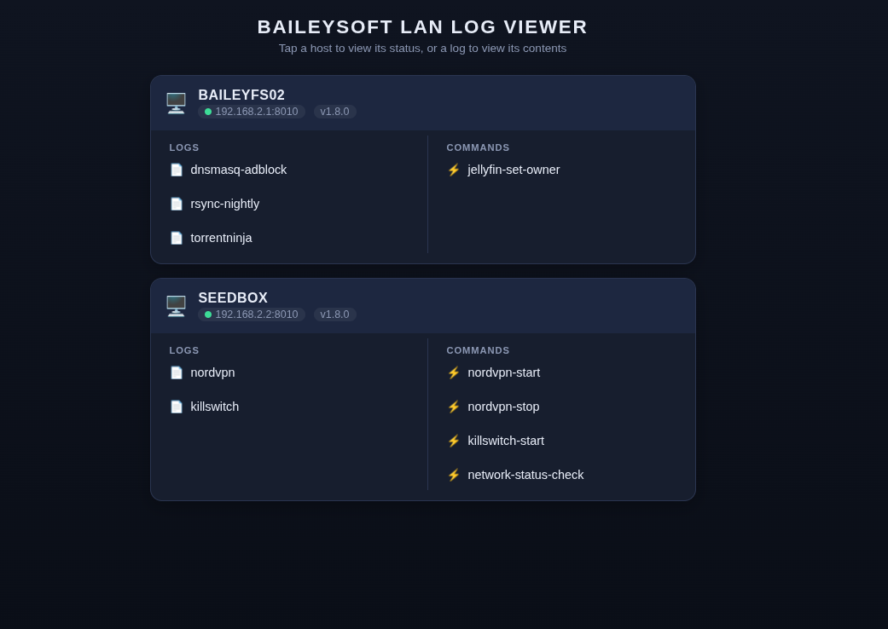

# LogAgent

[](https://www.python.org/)
[](https://developer.mozilla.org/en-US/docs/Web/HTML)
[](LICENSE)
[](#)
[](https://github.com/nealbailey/LogAgent/stargazers)

## Dashboard


Tiny log reader. This agent provides remote access to pre-determined log files (and scripts) on the host. Its designed and optimized to require no external dependencies and be as small and quick as possible.

## Installation

1. Clone the repository and change into the project directory:

	```bash
	git clone <repository-url>
	cd LogAgent
	```

2. Configure the log files in `logagent.json`. Add or remove entries as needed; each key becomes a log endpoint and each value must be the path to a readable log file:

	```json
	{
	  "settings": {
		 "line_limit": {
			"enabled": true,
			"lines": 200
		 }
	  },
	  "logs": {
		 "nordvpn": "/var/log/nordvpn.sh.log",
		 "killswitch": "/var/log/killswitch.sh.log"
	  },
	  "commands": {
		 "nordvpn-start": {
			"description": "Establishes a new tunnel connection to the VPN",
			"command": "/home/developer/git/Bash/nordvpn.sh",
			"args": ["-s", "-l"],
			"timeout": 60,
			"sudo": true
		 }
	  }
	}
	```

	`settings.line_limit` caps unfiltered log responses to the last `lines`
	lines. Set `enabled` to `false` (or remove the `settings` block) to always
	return the full log. This limit is ignored whenever a request includes the
	`search` parameter — searches always scan the entire log.

	Ensure the user running LogAgent has permission to read the configured files.

	`commands` is optional. Omit it (or leave it empty) if this agent should not
	expose any executable commands. Each key becomes a command endpoint
	(`POST /commands/<command-name>`). Supported fields:

	| Field         | Required | Default | Description                                                        |
	|---------------|----------|---------|--------------------------------------------------------------------|
	| `command`     | Yes      | —       | Absolute path of the executable or script to run.                  |
	| `description` | No       | —       | Human-readable description (for reference only; not returned by the API). |
	| `args`        | No       | `[]`    | Array of arguments passed to the command.                          |
	| `timeout`     | No       | `60`    | Seconds to allow the command to run before it is forcibly killed.  |
	| `sudo`        | No       | `false` | Run the command via `sudo -n`. Only enabled when explicitly `true`. |

	> **Important: commands with `"sudo": true` require a sudoers entry.**
	> The `logagent` user does not, and should not, have general admin/sudo
	> rights. LogAgent runs sudo commands non-interactively (`sudo -n`), so
	> without a matching `NOPASSWD` rule the command will fail immediately.
	> Edit the sudoers config with `sudo visudo` (or create a drop-in with
	> `sudo visudo -f /etc/sudoers.d/logagent`) and add one line per script:
	>
	> ```text
	> logagent ALL=(root) NOPASSWD: /home/developer/git/Bash/nordvpn.sh
	> logagent ALL=(root) NOPASSWD: /home/developer/git/Bash/killswitch.sh
	> ```
	>
	> Only grant the exact script paths configured in `logagent.json`. Make sure
	> those scripts (and their parent directories) are owned by root and not
	> writable by `logagent` or other non-admin users, otherwise the script
	> could be modified and run as root.

3. Start the agent:

	```bash
	python3 logagent.py
	```

	The agent listens on port `8010`. Request `/` to list configured logs or `/<log-name>` to read a log, for example:

	```text
	http://localhost:8010/nordvpn
	```

## Run as an Ubuntu daemon

On Ubuntu 22.04 or newer, create a dedicated `systemd` service so LogAgent can
be managed with `systemctl`.

1. From the project directory, configure `logagent.json`, then install the
   application files under `/opt/logagent`:

	```bash
	sudo mkdir -p /opt/logagent
	sudo cp logagent.py logreader.py logagent.json /opt/logagent/
	```

2. Create a service account and grant it access to standard system logs:

	```bash
	sudo useradd --system --no-create-home --shell /usr/sbin/nologin logagent
	sudo usermod --append --groups adm logagent
	sudo chown -R root:root /opt/logagent
	```

	If the paths in `logagent.json` are not readable by the `adm` group, update
	the file permissions or group ownership so the `logagent` user can read them.

3. Create `/etc/systemd/system/logagent.service` with the following contents:

	```ini
	[Unit]
	Description=LogAgent log reader
	After=network.target

	[Service]
	Type=simple
	User=logagent
	Group=logagent
	WorkingDirectory=/opt/logagent
	ExecStart=/usr/bin/python3 /opt/logagent/logagent.py
	Restart=on-failure

	[Install]
	WantedBy=multi-user.target
	```

4. Reload `systemd`, enable the service at boot, and start it:

	```bash
	sudo systemctl daemon-reload
	sudo systemctl enable --now logagent.service
	sudo systemctl status logagent.service
	```

5. Use the standard `systemctl` commands to control the daemon:

	```bash
	sudo systemctl start logagent.service
	sudo systemctl stop logagent.service
	sudo systemctl restart logagent.service
	sudo systemctl disable logagent.service
	```

	View service output with:

	```bash
	sudo journalctl --unit logagent.service --follow
	```

## Usage

LogAgent provides HTTP GET endpoints for reading logs and HTTP POST endpoints
for executing configured commands:

```text
GET  /
GET  /<log-name>
POST /commands/<command-name>
```

### List available logs and commands

Request `/` to return the hostname, port, configured log names, and any
commands exposed by this agent. Only names are returned; command paths, args,
timeouts, and sudo settings are never exposed (`commands` is `[]` when none are
configured):

```bash
curl -l http://localhost:8010/
```

```json
{
	"hostname": "popos-desktop",
	"port": 8010,
	"build_version": "1.8.0",
	"line_limit": {
		"enabled": true,
		"lines": 200
	},
	"logs": [
		"nordvpn",
		"killswitch"
	],
	"commands": [
		"nordvpn-start",
		"nordvpn-stop",
		"killswitch-start"
	]
}
```

### Read a log

Request `/<log-name>` to return the contents of a configured log:

```bash
curl -l http://localhost:8010/killswitch
```

```text
2024-02-09T10:32 Started executing script tasks.
2024-02-09T10:32 There is no vpn tunnel established to secure (iface tun0).
```

Add the optional `search` parameter to return only lines containing the
specified string. The search is case-insensitive and URL-encoded by `curl`:

```bash
curl -G --data-urlencode 'search=vpn tunnel' http://localhost:8010/killswitch/
```

If no lines match, the response is:

```text
No matches found in log.
```

### Execute a command

Send a `POST` to `/commands/<command-name>` to run a configured command.
Commands use POST because they can change system state.

```bash
curl -X POST http://localhost:8010/commands/nordvpn-start
```

On completion the response contains the exit code and captured output. The
HTTP status is `200` when the command exits with `0`, otherwise `500`:

```json
{
	"success": true,
	"exit_code": 0,
	"stdout": "...",
	"stderr": ""
}
```

If the command exceeds its `timeout`, it is killed and the response is:

```json
{
	"success": false,
	"error": "Command timed out after 60 seconds"
}
```

Unknown command names return `404` with the list of `available_commands`.
A sudo command without a matching sudoers entry fails with a non-zero exit
code and a `sudo: a password is required` message in `stderr`.

In `index.html`, commands are listed with a ⚡ icon (logs use 📄). Clicking a
command shows a confirmation prompt before it is executed.
